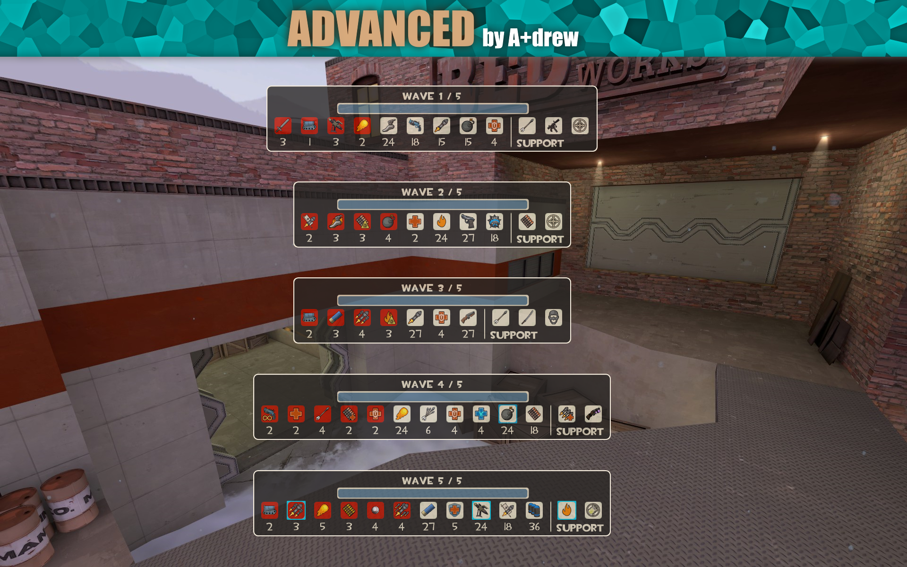

This is a mvm map set in a snowy and remote outpost. Your task is to help defend Mannco from Greymanns robotic invasion.
This map was made for the Canteen Crasher Contest, but unfortunately it hasn´t made it into the campaign.

Download the files via Github, because the Steam Workshop version only contains the .bsp and .nav files. The [url=https://drive.google.com/file/d/1uROpVMG8qtI48-nt0qMjLm5V5TiIalVF/view] Google Drive version [/url] additionally contains the .pop files (normal, intermediate, advanced and expert).

Thanks to [url=https://steamcommunity.com/profiles/76561198080260467/]Sergeant Crwhips[/url] and [url=https://steamcommunity.com/id/Xtremely2932/]A+drew[/url] for creating the included missions.

The map is currently not hosted on any servers.
How to load the map:
To play the Steam Workshop version paste: "map workshop/1502600048" into your console.
To play the Github version paste: "map mvm_outpost" into your console.

[Diva Dan's Ice Pack](url=https://tf2maps.net/downloads/diva-dans-ice-pack.5553/)

Some hud icons used are from the [Canteen Crasher asset pack](url=https://drive.google.com/file/d/1HZkceWJbGlp7Eixoiv0-gyqN-ZknzMCd/view)
